# NetworkDiversityOptimizer — Documentation

## Overview

The `NetworkDiversityOptimizer` adjusts the **time shifts** of individual building consumers in a district heating network so that their peak loads no longer coincide. By spreading peaks apart, the **simultaneity factor** on each pipe edge approaches a physically realistic target curve, allowing pipes to be dimensioned smaller and the network to run more efficiently.

```mermaid
flowchart TD
    UI["🖱 Optimize Button Clicked<br>(SVPropNetworkStaticAnalysis)"] --> A
    A["Constructor<br>(Network &amp;)"] --> B["initializeOptimizationGraph()"]
    B --> C["optimize()"]
    C --> D["precomputeProfiles()"]
    D --> E["Multi-Start Hill Climbing<br>(restarts loop)"]
    E --> F["Phase 1 — Coarse<br>runCoordinateDescentPhase()"]
    F --> G["Phase 2 — Medium<br>runCoordinateDescentPhase()"]
    G --> H["Phase 3 — Fine<br>runCoordinateDescentPhase()"]
    H --> I["Track best solution"]
    I -->|next restart| E
    I --> J["recalculateFinalProfiles()"]

    style UI fill:#E3F2FD,stroke:#1565C0,stroke-width:2px
```



---

## Supporting Structs

### `DiversityConfig`

Configuration parameters that control the optimizer's behavior. Stored as `m_config` inside the optimizer.

| Member | Type | Default | Purpose |
|---|---|---|---|
| `m_numRestarts` | `int` | `5` | Number of random restarts in the multi-start strategy. The first restart always starts from zero shifts (baseline). |
| `m_maxIterations` | `int` | `5` | Maximum coordinate-descent iterations per optimization phase before forced stop. |
| `m_maxShiftHours` | `double` | `3.0` | Maximum allowed time shift in either direction (±hours). Shifts are clamped to this range. |
| `m_roundShiftToHours` | `double` | `0.25` | Granularity for rounding shifts (e.g., `0.25` = 15-minute increments). Set to `0` to disable rounding. |
| `m_useSinglePhase` | `bool` | `false` | If `true`, uses a single merged phase with 12 deltas. If `false` (recommended), uses 3 separate phases (coarse → medium → fine) which produces lower error. |

---

### `OptimizationEdge`

A wrapper around `VICUS::NetworkEdge` that adds optimization-specific data without modifying the original network edge class.

| Member | Type | Purpose |
|---|---|---|
| `m_networkEdge` | `const NetworkEdge*` | Pointer to the underlying network edge. Changes to the network are automatically reflected. |
| `m_aggregatedProfile` | `std::vector<double>` | The summed load profile of all downstream consumers (after applying their time shifts). Populated by `recalculateFinalProfiles()`. |
| `m_sumIndividualPeaks` | `double` | Sum of individual consumer peak loads. Used as the denominator when computing the actual simultaneity factor. |
| `m_downstreamConsumers` | `std::vector<const NetworkNode*>` | Pointers to all building nodes downstream of this edge (determined via shortest-path analysis). |
| `m_numberDownStreamBuildings` | `unsigned int` | Count of downstream consumers. Used as the input `N` to look up the target simultaneity from the spline. |

> [!NOTE]
> `m_downstreamConsumers` and `m_numberDownStreamBuildings` are marked `mutable` because they are populated during graph initialization and may be updated without changing the logical const-ness of the edge.

---

## Class: `NetworkDiversityOptimizer`

### Constructor

```cpp
NetworkDiversityOptimizer(Network& network);
```

| Parameter | Description |
|---|---|
| `network` | Reference to the `VICUS::Network` containing all nodes, edges, and the simultaneity spline. The optimizer stores a pointer to this network. |

**What it does:**
1. Stores the network pointer (`m_network`).
2. Immediately calls `initializeOptimizationGraph()` to build the internal optimization data structures from the network topology.

---

## Public Methods

### `optimize`

```cpp
double optimize(IBK::Notification* notifier = nullptr);
```

| Parameter | Description |
|---|---|
| `notifier` | Optional pointer to a progress notifier. When non-null, the optimizer reports progress (0.0–1.0) after each restart and checks `notifier->m_aborted` to allow the user to cancel mid-run. |

| Returns | Description |
|---|---|
| `double` | The best (lowest) total squared error achieved across all restarts. Returns `-1.0` if the network pointer is null. |

**What it does — step by step:**

1. **Sets the simultaneity spline** from `m_network->m_simultaneity`. This spline maps the number of downstream consumers `N` to the expected simultaneity factor.
2. **Calls `precomputeProfiles()`** to extract the peak-day load profile for every consumer and store it as an `IBK::LinearSpline`.
3. **Runs multi-start hill climbing** (`m_config.m_numRestarts` restarts):
   - **Restart 0:** All shifts initialized to `0.0` (baseline measurement).
   - **Restarts 1+:** Shifts randomized within `±m_config.m_maxShiftHours`.
   - Each restart runs **three coordinate-descent phases** with progressively finer shift increments:
     - **Phase 1 (Coarse):** tries `±2.25h, ±1.5h, ±1.0h` (6 deltas)
     - **Phase 2 (Medium):** tries `±0.75h, ±0.5h` (4 deltas)
     - **Phase 3 (Fine):** tries `±0.25h` (2 deltas)
   - The best-performing shift configuration (lowest total squared error) is saved globally.
4. **Restores the best solution** found across all restarts.
5. **Calls `recalculateFinalProfiles()`** so that edge aggregate profiles reflect the optimal shifts.

```mermaid
flowchart TD
    A["optimize() called"] --> B["Set simultaneity spline"]
    B --> C["precomputeProfiles()"]
    C --> D{"restart = 0"}

    subgraph PARALLEL_RESTARTS ["♻ Restart Loop — PARALLELIZABLE"]
        direction TB
        D --> E{"restart == 0?"}
        E -->|Yes| F["Initialize all shifts = 0.0"]
        E -->|No| G["randomizeShifts()"]
        F --> H["Calculate initial error"]
        G --> H

        subgraph PHASES ["Three Sequential Phases"]
            direction TB
            H --> P1["Phase 1: Coarse<br/>deltas: ±2.25, ±1.5, ±1.0"]
            P1 --> P2["Phase 2: Medium<br/>deltas: ±0.75, ±0.5"]
            P2 --> P3["Phase 3: Fine<br/>deltas: ±0.25"]
        end

        P3 --> K["Calculate final error"]
        K --> L{"error < bestGlobalError?"}
        L -->|Yes| M["Save shifts as best solution"]
        L -->|No| N["Discard this restart"]
        M --> O{"More restarts?"}
        N --> O
        O -->|Yes| D
    end

    O -->|No| Q["Restore best global shifts"]
    Q --> R["recalculateFinalProfiles()"]
    R --> S["Return best error"]

    style PARALLEL_RESTARTS stroke:#2196F3,stroke-width:2px,stroke-dasharray: 5 5
    style PHASES stroke:#FF9800,stroke-width:2px
```



> [!TIP]
> **Parallelization opportunities:**
> - **Restarts** (blue dashed box): Each restart is fully independent — different random starting shifts, no shared state during optimization. These can run on separate threads with a final reduction to pick the best result.
> - **Consumer evaluations** within `runCoordinateDescentPhase`: Each consumer's shift evaluation reads shared edge data but only writes to its own shift. With careful synchronization, consumers on non-overlapping edges can be evaluated in parallel.
> - **Edge error computation**: Within `calculateLocalError`, the error for each edge can be computed independently and summed.

**Why multi-start?** The optimization landscape is non-convex (many local minima). Multiple random starting points increase the chance of finding a good global solution. Explained in detail in the next section.

**Why three phases?** Coarse phases quickly explore the search space; fine phases polish the solution. This avoids getting stuck in coarse local minima while still being computationally efficient. Explained in detail below.

#### Why Multi-Start Hill Climbing?

The diagram below shows the **error landscape** — imagine plotting the total squared error (Y-axis) for every possible shift configuration (X-axis). The optimizer tries to find the lowest point:

```
  Error
  ▲
  │
  │   ╭╮                          ╭╮
  │  ╭╯╰╮        ╭╮              ╭╯╰╮
  │ ╭╯  ╰╮      ╭╯╰╮            ╭╯  ╰╮
  │╭╯    ╰╮    ╭╯  ╰╮    ╭╮    ╭╯    ╰╮
  ││      ╰╮  ╭╯    ╰╮  ╭╯╰╮  ╭╯      │
  ││       ╰╮╭╯      ╰╮╭╯  ╰╮╭╯       │
  ││        ╰╯        ╰╯    ╰╯        │
  ││     Local Min   GLOBAL   Local    │
  ││    (error=0.04)  MIN    (error=   │
  ││                (0.02)    0.05)    │
  │╰───────────────────────────────────╯
  └─────────────────────────────────────▶ Shift Configuration
       ↓              ↓           ↓
    Restart 1      Restart 2   Restart 3
    lands here     lands here  lands here
    (stuck!)       (best! ✓)   (stuck!)
```

**The key problem:** A hill-climber can only move **downhill** (follow the slope). Once it reaches a valley floor, it stops — even if a deeper valley exists elsewhere. It cannot climb over the hill between valleys.

To understand this, we first need to understand the concept of **local and global minima** in this specific problem.

**What is a minimum?** The optimizer minimizes the total squared error — the gap between actual and target simultaneity across all edges. A **minimum** is a shift configuration where no small change to any single consumer's shift reduces the error further. Think of it as a valley in the landscape above: you can't go any lower by taking small steps.

**Global minimum** = the absolute best solution (the deepest valley in the diagram — error 0.02).
**Local minimum** = a solution that *looks* best from where you stand, but a better one exists elsewhere (the shallower valleys — error 0.04 or 0.05).

**Why do multiple minima exist in this problem?** Consider a simple example with 3 consumers (A, B, C) sharing one pipe:

- **Solution 1:** A at 0h, B at +2h, C at -2h → peaks are spread → low error
- **Solution 2:** A at +1h, B at -1h, C at 0h → peaks are also spread → low error
- **Solution 3:** A at +2h, B at 0h, C at -2h → peaks spread differently → low error

All three solutions achieve similar error, but they are in completely different parts of the search space. Once the optimizer settles into one of these configurations (e.g., Solution 1), small changes only make things worse — it's stuck in that local minimum and can't "see" that Solution 2 might be slightly better.

The problem gets worse with more consumers and more edges: each consumer's optimal shift depends on *every other consumer's* shift (because they share edges), creating a tangled landscape with many valleys.

**Multi-start solves this** by running the optimization several times from different random starting positions. Each start may land in a different valley. The optimizer then picks the deepest valley found across all starts:

```
Restart 0: Start at all-zeros    → finds local minimum with error 0.0023
Restart 1: Start at random shifts → finds local minimum with error 0.0019  ← best!
Restart 2: Start at random shifts → finds local minimum with error 0.0031
```

#### Why Three Phases Instead of One?

A single phase with all deltas mixed together would work, but it would be **slow and imprecise**. Here's why the three-phase design is better:

**Problem with only large deltas (e.g., ±2.25h, ±1.5h):** The optimizer can make big jumps but can never fine-tune. If the true optimum is at +1.25h, it can jump to +1.0h or +1.5h but never reach +1.25h.

**Problem with only small deltas (e.g., ±0.1h, ±0.25h):** The optimizer can fine-tune precisely, but needs many iterations to travel far. Getting from 0h to +3h in 0.25h steps takes 12 iterations — and for each iteration, it evaluates every consumer across all edges. This is very slow.

**Solution — progressively finer phases:**

| Phase | Purpose | Analogy |
|---|---|---|
| **Phase 1 (Coarse)** | Explore broadly, jump to the right neighborhood | Driving to the right street |
| **Phase 2 (Medium)** | Narrow down to the right area | Walking to the right building |
| **Phase 3 (Fine)** | Polish to the exact optimal position | Stepping to the right door |

Each phase inherits the result of the previous one. Phase 1 quickly gets close, Phase 2 fills gaps, Phase 3 polishes. Total work is much less than doing everything with tiny steps.

#### How the Three Phases Cover the Full Search Space

The shift deltas listed above are **not absolute positions** — they are **increments added to the consumer's current shift**. Because each phase runs up to `m_maxIterations` (default 5) full sweeps, a consumer's shift can move **multiple times** within a single phase. This cumulative effect means the three phases together can reach every position in the `[-3.0, +3.0]` range at `0.25h` granularity.

**Key mechanism: deltas accumulate across iterations.**

In each iteration, the optimizer tries adding each delta to the consumer's *current* shift. If any delta reduces the error, the new shift *sticks*, and the next iteration starts from there. This means the consumer can "walk" across the search space in steps.

**Worked example — a consumer starting at shift `0.0h`:**

| Step | Phase | Current Shift | Best Delta | New Shift | Note |
|---|---|---|---|---|---|
| Iter 1 | Phase 1 | `0.00h` | `+1.00h` | `1.00h` | Jumps +1.0h |
| Iter 2 | Phase 1 | `1.00h` | `+1.50h` | `2.50h` | Accumulates to +2.5h |
| Iter 3 | Phase 1 | `2.50h` | none improves | `2.50h` | Converged for Phase 1 |
| Iter 1 | Phase 2 | `2.50h` | `+0.25h` | `2.75h` | Fine-tunes by +0.25h |
| Iter 2 | Phase 2 | `2.75h` | none improves | `2.75h` | Converged for Phase 2 |
| Iter 1 | Phase 3 | `2.75h` | `+0.10h` | `2.75h` | +0.10h snaps to `2.75h` (no change) |
| — | — | — | — | **`2.75h`** | Final optimized shift |

After snapping (`m_roundShiftToHours = 0.25`), the full set of **reachable positions** in `[-3.0, +3.0]` is:

```
-3.00, -2.75, -2.50, -2.25, -2.00, -1.75, -1.50, -1.25,
-1.00, -0.75, -0.50, -0.25,  0.00,  0.25,  0.50,  0.75,
 1.00,  1.25,  1.50,  1.75,  2.00,  2.25,  2.50,  2.75,  3.00
```

That is **25 discrete positions** — the complete grid. Here is how each phase contributes to reaching them:

| Phase | Deltas | Role | Example Reachable Jumps (from 0) |
|---|---|---|---|
| **Phase 1 (Coarse)** | `±2.25, ±1.5, ±1.0` | Large leaps to explore far-away regions | `0 → 1.0 → 2.5`, `0 → 2.25`, `0 → -1.5 → -3.0` |
| **Phase 2 (Medium)** | `±0.75, ±0.5` | Fill gaps between coarse positions | `2.0 → 2.25`, `1.5 → 2.25`, `0.5 → 0.75` |
| **Phase 3 (Fine)** | `±0.25` | Polish to the nearest 0.25h increment | `2.50 → 2.75`, `1.00 → 0.75` |

> [!IMPORTANT]
> The phases are run **sequentially** within each restart. Each phase inherits the shifts from the previous phase, so Phase 2 refines what Phase 1 found, and Phase 3 polishes what Phase 2 produced. The combination of large jumps (Phase 1) + medium adjustments (Phase 2) + fine tuning (Phase 3) ensures that:
> 1. **Every 0.25h grid point is reachable** from any starting position within a few iterations.
> 2. **The optimizer does not waste time** testing tiny increments when the shift is far from optimal (Phase 1 handles large moves).
> 3. **Precision is not sacrificed** — Phase 3 ensures the final solution is polished to the nearest valid increment.

---

### `recalculateFinalProfiles`

```cpp
void recalculateFinalProfiles();
```

Takes no parameters.

**What it does:**
For every `OptimizationEdge`, it:
1. Clears the existing `m_aggregatedProfile` and `m_sumIndividualPeaks`.
2. Iterates over all `m_downstreamConsumers`, retrieves each consumer's shifted profile via `shiftedProfile()`, and sums them into `m_aggregatedProfile`.
3. Accumulates the individual peak of each consumer into `m_sumIndividualPeaks`.

**Why it exists:** During optimization, only locally-affected edges are updated for speed (`calculateLocalError`). After the best solution is selected, this function ensures *all* edges have consistent, fully-recomputed profiles for downstream use (e.g., visualization, pipe sizing).

---

### `edges`

```cpp
const std::vector<OptimizationEdge>& edges() const;
```

Returns a const reference to the internal `m_optimizationEdges` vector. Used by external code (e.g., the UI in `SVPropNetworkStaticAnalysis`) to inspect results, display simultaneity factors, or visualize the optimized profiles.

---

## Private Methods

### `initializeOptimizationGraph`

```cpp
void initializeOptimizationGraph();
```

**What it does:**

1. **Clears** previous optimization state (`m_optimizationEdges`, `m_activeConsumers`, `m_consumerToEdgesMap`).
2. **Updates network pointers** via `m_network->updateNodeEdgeConnectionPointers()` to ensure internal pointer consistency.
3. **Collects consumer nodes** — iterates all network nodes and picks those with type `NT_SubStation` into `m_activeConsumers`.
4. **Finds shortest paths** via `m_network->findShortestPathForBuildings(...)`. This returns, for each source node, the set of paths to every building, where each path is a sequence of edges.
5. **Builds `edgeToConsumersMap`** — for every edge that appears in any building path, records which building nodes are downstream of it.
6. **Creates `OptimizationEdge` objects** — wraps each `NetworkEdge` with its downstream consumer list and count.
7. **Builds `m_consumerToEdgesMap`** — the reverse mapping: for each consumer node ID, stores pointers to the `OptimizationEdge`s it affects. This enables O(1) lookup of affected edges when a single consumer's shift changes.

**Why this design:** By precomputing which consumers affect which edges, the optimizer avoids recomputing the entire network error (O(E)) when only one consumer changes. Instead, it evaluates only the affected edges (typically O(1)–O(log E)).

---

### `precomputeProfiles`

```cpp
void precomputeProfiles();
```

**What it does:**


1. **Aggregates all consumer profiles** into a network-wide hourly load curve (8760 hours).
2. **Identifies the global peak day** — the 24-hour window where the network aggregate load is highest.
3. **Extracts each consumer's 24-hour profile** for that peak day.
4. **Stores each profile as an `IBK::LinearSpline`** (25 points: hours 0–24, with hour 24 = hour 0 for cyclic wrapping). This enables fractional-hour interpolation during shifting.
5. **Initializes all time shifts to `0.0`**.

**Why peak day only?** Simultaneity is most critical at peak load. Optimizing for the peak day ensures the network is correctly dimensioned for the worst case. Using a single 24-hour window also keeps the problem tractable.

**Why LinearSpline?** Storing 25 control points per consumer instead of a dense array is memory-efficient. The spline provides smooth linear interpolation for arbitrary fractional shifts (e.g., shifting by 1.25 hours), preserving profile shape and peak magnitude.

---

### `runCoordinateDescentPhase`

```cpp
void runCoordinateDescentPhase(
    const std::vector<double>& shifts,
    double maxShift,
    int maxIterations
);
```

| Parameter | Description |
|---|---|
| `shifts` | Vector of shift deltas to try for each consumer (e.g., `{-1.0, 1.0, -0.5, 0.5}`). Each value is added to the consumer's current shift. |
| `maxShift` | Maximum allowed absolute shift (hours). Candidate shifts are clamped to `[-maxShift, +maxShift]`. |
| `maxIterations` | Maximum number of full sweeps over all consumers before stopping. |

**What it does — per iteration:**

```mermaid
flowchart TD
    A["Start Phase"] --> B["Shuffle consumer order"]
    B --> C["Pick next consumer"]
    C --> D["Look up affected edges"]
    D --> E["Compute current local error"]
    E --> F["Try next delta from shifts list"]
    F --> G["candidateShift = currentShift + delta"]
    G --> H["Snap to increment, clamp to maxShift"]
    H --> I{"New error<br>< best error?"}
    I -->|Yes| J["Save as best shift"]
    I -->|No| K{"More deltas?"}
    J --> K
    K -->|Yes| F
    K -->|No| L{"Best shift<br>improved?"}
    L -->|Yes| M["Apply best shift"]
    L -->|No| N["Revert to original shift"]
    M --> O{"More consumers?"}
    N --> O
    O -->|Yes| C
    O -->|No| P{"Total improvement<br>< 1e-6?"}
    P -->|Yes| Q["Converged — exit phase"]
    P -->|No| B
```



1. **Shuffles** the consumer order (randomized to avoid ordering bias).
2. **For each consumer:**
   - Looks up the edges affected by this consumer (`m_consumerToEdgesMap`).
   - Evaluates the current local error on those edges (`calculateLocalError`).
   - Tries every delta in `shifts`: computes `candidateShift = currentShift + delta`, snaps it to the configured increment, clamps it, applies it temporarily, and evaluates the new local error.
   - **Keeps the best shift** if it reduces the local error by more than `1e-9`.
   - **Reverts** if no improvement was found.
3. **Convergence check:** If no consumer changed in a full sweep (total improvement < `1e-6`), the phase terminates early.

**Why coordinate descent?** Each consumer's shift is a single scalar variable. Optimizing one variable at a time while holding others fixed is simple, robust, and efficient for this problem structure.

**Why shuffle?** Randomizing the order prevents systematic bias where early consumers always get the "best" shifts and later consumers are constrained.

---

### `calculateTotalError`

```cpp
double calculateTotalError() const;
```

| Returns | Description |
|---|---|
| `double` | Sum of squared errors across all edges with ≥ 2 downstream consumers. |

**What it does for each qualifying edge:**

1. **Aggregates shifted profiles** of all downstream consumers into a combined load curve.
2. **Computes actual simultaneity:**
   ```
   σ_actual = peak(aggregated_profile) / Σ(individual_peaks)
   ```
3. **Looks up target simultaneity** from the spline: `σ_target = spline(N)`.
4. **Accumulates squared error:** `(σ_actual − σ_target)²`.

**Why squared error?** Standard least-squares approach — penalizes large deviations more than small ones, providing a smooth optimization landscape.

**Why skip edges with < 2 consumers?** Simultaneity is only meaningful when multiple consumers share an edge. A single consumer always has simultaneity = 1.0.

---

### `calculateLocalError`

```cpp
double calculateLocalError(const std::vector<OptimizationEdge*>& edges);
```

| Parameter | Description |
|---|---|
| `edges` | Subset of edges to evaluate (typically only those affected by a single consumer's shift change). |

| Returns | Description |
|---|---|
| `double` | Sum of squared errors for the given edges only. |

**Identical logic to `calculateTotalError`**, but restricted to the provided edge subset. This is the key performance optimization — when trying a shift change for one consumer, only its affected edges (looked up via `m_consumerToEdgesMap`) need re-evaluation instead of the entire network.

---

### `shiftedProfile`

```cpp
std::vector<double> shiftedProfile(const NetworkNode* node) const;
```

| Parameter | Description |
|---|---|
| `node` | Pointer to a consumer node whose shifted profile is requested. |

| Returns | Description |
|---|---|
| `std::vector<double>` | 24-element vector representing the consumer's hourly load on the peak day, shifted by the consumer's current `m_nodeTimeShifts[id]` value. Empty vector if no profile exists. |

**What it does:**

Imagine a consumer's heating demand over 24 hours as a curve drawn on a strip of paper that loops around (midnight connects back to midnight). "Shifting" means sliding that strip left or right by a number of hours. For example, if a building's peak heating is at 10:00 and we apply a +2h shift, the peak moves to 12:00. The function reads the original curve, slides it by the requested amount, and returns the new 24-hour profile. If the slide pushes values past midnight, they wrap around to the other side of the day.


1. **Retrieves the base profile spline** from `m_profileSplines`.
2. **For each hour `i` (0–23):**
   - Computes `t_shifted = i - shift` (subtracting the shift means a positive shift moves the profile *forward* in time).
   - **Wraps cyclically** to `[0, 24)` using `while` loops — the day is treated as circular (handles shifts larger than 24h).
   - Evaluates the spline at `t_shifted` to get the interpolated load value.
3. Returns the 24-element result vector.

**Why cyclic wrapping?** Load profiles repeat daily. A shift that pushes values past midnight should wrap them to the beginning of the day rather than losing data.

> [!NOTE]
> This function currently recomputes the profile on every call (no caching). See the [Performance TODO](#performance-todo) section for improvement ideas.

---

### `randomizeShifts`

```cpp
void randomizeShifts(double maxShift);
```

| Parameter | Description |
|---|---|
| `maxShift` | Maximum shift magnitude in hours. Each consumer receives a random shift in `[-maxShift, +maxShift]`. |

**What it does:**
1. Generates a uniform random value in `[-1, 1]` for each consumer.
2. Scales it by `maxShift`.
3. Snaps to the configured increment via `snapToIncrement()`.

**Why randomize?** Provides diverse starting points for the multi-restart strategy, helping escape local minima.

---

### `snapToIncrement`

```cpp
double snapToIncrement(double shift) const;
```

| Parameter | Description |
|---|---|
| `shift` | Raw shift value in hours. |

| Returns | Description |
|---|---|
| `double` | Shift rounded to the nearest multiple of `m_config.m_roundShiftToHours`. If rounding is disabled (`0.0`), returns the input unchanged. |

**Example:** With `m_roundShiftToHours = 0.25`:
- `1.734h → 1.75h`
- `0.12h → 0.0h`
- `-2.63h → -2.75h`

**Why snap?** In real-world district heating, control systems typically operate in discrete time steps (e.g., 15-minute intervals). Rounding shifts to practical increments ensures the optimizer produces implementable results.

---

## Member Variables

| Member | Type | Purpose |
|---|---|---|
| `m_network` | `Network*` | Pointer to the VICUS network. Source of topology, node/edge data, and the simultaneity spline. |
| `m_optimizationEdges` | `std::vector<OptimizationEdge>` | All edges participating in optimization, each with their downstream consumer data. |
| `m_consumerToEdgesMap` | `std::map<unsigned int, std::vector<OptimizationEdge*>>` | Maps `consumerNodeId → [affected edges]`. Enables efficient local error computation. |
| `m_activeConsumers` | `std::vector<NetworkNode*>` | All consumer (SubStation) nodes in the network. These are the variables being optimized. |
| `m_config` | `DiversityConfig` | Algorithm parameters (restarts, iterations, max shift, rounding). |
| `m_simultaneitySpline` | `const IBK::LinearSpline*` | Target simultaneity curve from the network. Maps `N` (number of consumers) to the expected simultaneity factor. |
| `m_nodeTimeShifts` | `std::map<unsigned int, double>` | Maps `consumerNodeId → current time shift (hours)`. The primary decision variables of the optimization. |
| `m_profileSplines` | `std::map<unsigned int, IBK::LinearSpline>` | Maps `consumerNodeId → peak-day load profile spline`. Memory-efficient representation (25 points per consumer). |

---

## Algorithm Summary

The optimizer solves the following problem:

> **Minimize** the sum of squared differences between actual and target simultaneity factors across all network edges, by adjusting the time shift of each consumer's peak-day load profile within `±maxShift` hours.

```
min  Σ_e ( σ_actual(e) − σ_target(N_e) )²
s.t. |shift_i| ≤ maxShift   ∀ consumer i
```

Where:
- `σ_actual(e) = peak(Σ shifted_profiles) / Σ individual_peaks` for edge `e`
- `σ_target(N_e)` is the target simultaneity for `N_e` downstream consumers (from the Winter et al. sigmoid spline)
- `shift_i` is the time shift applied to consumer `i`

The algorithm uses **multi-start coordinate descent** with **three-phase refinement** to navigate the non-convex landscape efficiently.

---

## Performance TODO

The optimizer is currently slow for large networks. Below are the main bottlenecks and concrete improvements to address them, ordered by expected impact.

### 1. Introduce Shifted Profile Caching

**Problem:** `shiftedProfile()` is called repeatedly for the same consumer with the same shift — once from every edge that consumer belongs to. Without caching, the spline is re-evaluated 24 times per call, redundantly.

**Impact:** This is the single biggest bottleneck. A consumer on `K` edges has its profile computed `K` times per error evaluation instead of once.

**Fix:** Re-add `m_shiftedProfileCache` (a `mutable std::map<unsigned int, std::vector<double>>`). Return cached results when the shift hasn't changed. Invalidate (erase) a consumer's cached entry only when its shift actually changes in `runCoordinateDescentPhase`.

```cpp
// In shiftedProfile():
auto itCache = m_shiftedProfileCache.find(id);
if (itCache != m_shiftedProfileCache.end())
    return itCache->second;
// ... compute ...
m_shiftedProfileCache[id] = result;

// In runCoordinateDescentPhase(), when shift changes:
m_shiftedProfileCache.erase(id);
```

### 2. Pre-compute and Cache Individual Consumer Peaks

**Problem:** `*std::max_element(profile.begin(), profile.end())` is called inside every edge evaluation for every downstream consumer. Since the peak of a consumer's profile only changes when its shift changes, this is redundant work.

**Fix:** Store each consumer's peak in a `std::map<unsigned int, double> m_consumerPeaks`. Update it only when a consumer's shift changes. Use the stored value in `calculateLocalError` and `calculateTotalError` instead of recomputing.

### 3. Avoid Redundant `calculateTotalError` Calls

**Problem:** `calculateTotalError()` iterates over *all* edges and recomputes every profile. It is called:
- Once at the start of each restart (`initialError`)
- Once at the end of each restart (`finalError`)
- Once at the end of each phase (from `runCoordinateDescentPhase`)

That's 5+ full-network evaluations per restart, each O(E × C × 24).

**Fix:**
- Track the total error incrementally: when a consumer's shift changes, subtract the old local error and add the new one.
- Remove the `calculateTotalError()` call at the end of each phase (it's only used for debug output, already guarded by `#ifdef DEBUG_OUTPUT`).

### 4. Use `std::array<double, 24>` Instead of `std::vector<double>`

**Problem:** Every call to `shiftedProfile()` allocates a `std::vector<double>` on the heap (24 elements). With thousands of calls per optimization, this creates significant allocation pressure.

**Fix:** Replace `std::vector<double>` with `std::array<double, 24>` for all 24-hour profiles. This eliminates heap allocation entirely — the profile lives on the stack.

### 5. Precompute Aggregated Profiles Incrementally

**Problem:** When trying a candidate shift for one consumer, `calculateLocalError` rebuilds the entire aggregated profile for each affected edge from scratch — summing all downstream consumers.

**Fix:** Maintain a running aggregated profile per edge. When one consumer's shift changes:
1. Subtract the old shifted profile from the aggregate.
2. Add the new shifted profile.
3. Recompute only the peak of the updated aggregate.

This reduces per-candidate work from O(C × 24) to O(24).

### Summary of Expected Speedups

| Improvement | Current Cost | After Fix | Speedup Factor |
|---|---|---|---|
| Profile caching | O(K × 24) per consumer per eval | O(24) once + O(1) lookups | ~K× |
| Peak caching | O(24) per consumer per edge | O(1) lookup | ~24× per peak |
| Incremental error tracking | O(E × C × 24) per phase end | O(1) bookkeeping | Large |
| `std::array<double, 24>` | heap alloc per call | stack alloc | ~2-5× for alloc-heavy paths |
| Incremental aggregation | O(C × 24) per candidate | O(24) per candidate | ~C× |
